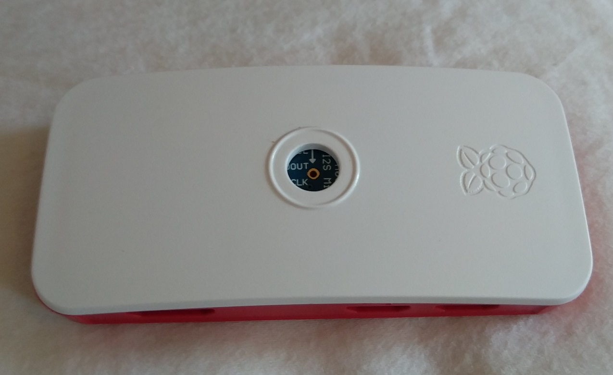
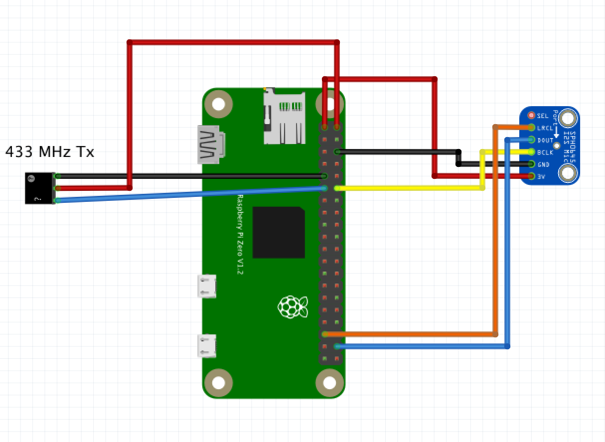
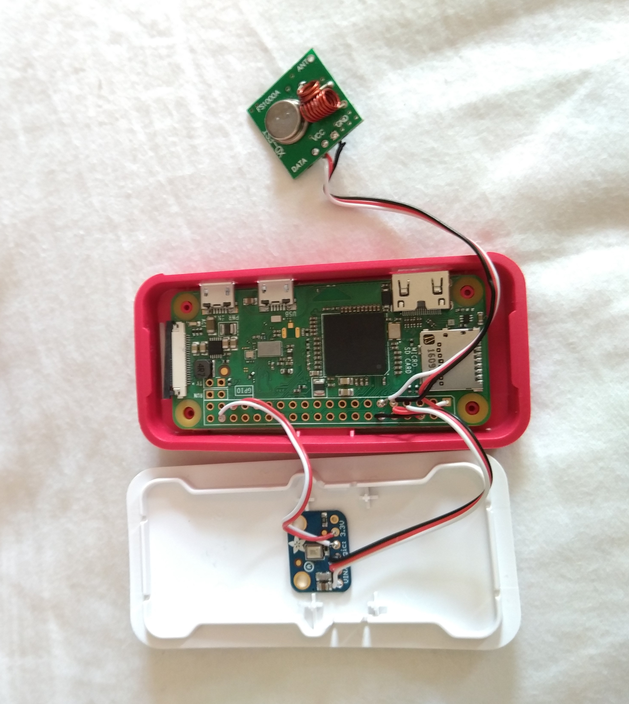
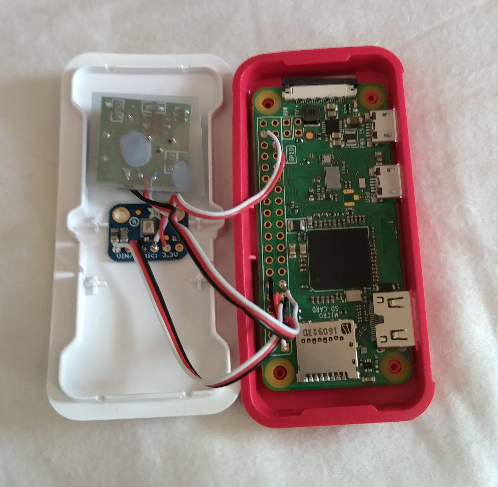

# Make your own voice controlled light switch - that really works!



Once you've had a Google Home or Alexa for a while you realise voice control is the future, but don't you just hate the way these current products have to send your voice off over the Internet to their big brother servers just to switch your local lights on, not to mention the annoying way they always give the unnecessary verbal confirmation - "Alright, switching off the bedroom light" - which you can already see perfectly well by the light having just gone off.

This shows you how to make your own voice controlled switch that avoids these problems, works well, and costs less than £20. It uses a Raspberry Pi Zero so is small and descrete, along with open source software based on Tensorflow machine learning. 

## Marvin and Sheila

To control your lights in an ideal world you would say something obvious like "lights on" and "lights off", however there are a couple of problems with those phrases.

One is "lights on" and "lights off" are very similar, both being mainly "lights o" and only differing by the end "n" and "ff", so using these gives annoying mis-detection errors.

Better could be something like "lamp on" and "lights off" but the problem with that is that there are no recordings of people saying "lamp" and we need lots of recordings of actual speech to train the machine learning neural network with. Without thousands of samples to train the model it is unreliable and doesn't work for many different peoples voices. So, to have something that actually works well I've used the keywords "Marvin" and "Sheila" to switch the lights on and off. There are sample recordings of thousands of people saying these so the trained model is accurate and the phrases are quite different which minimises mis-triggering.

You'll think it sounds odd saying Marvin and Sheila to control your lights, but it doesn't have all the "hey google" cruft or violate your privacy while bringing the benefits of voice control so you quickly get used to it.

## What you need:

- Raspberry Pi Zero (non-Wifi version is fine)
- I2S Microphone, eg SPH0645
- 433MHz transmitter module
- 433MHz remote control mains socket
- Pi Zero case to make it look nice

## Steps:

### Setup the Raspberry Pi Zero

Using the non-Wifi version of the Pi Zero its easiest to set it up for access from a PC over a USB cable. Install a fresh copy of [Raspbian Stretch Lite](https://www.raspberrypi.org/downloads/raspbian/) onto an SD Card and configure it for USB access following [this guide](https://gist.github.com/gbaman/975e2db164b3ca2b51ae11e45e8fd40a). 

All that done, connect the Pi to your PC with a USB cable, wait 90 seconds for it to boot up (you should see the green LED on the Pi flashing a bit as it boots) and then you should be able to logon to the Pi from your PC with ```ssh pi@raspberrypi.local``` and the password ```raspberry```. 

Along with logging on with SSH you can also copy files from your PC to the Pi Zero with: ```scp /path/to/file pi@raspberrypi.local:~``` and copy files from the Pi to your PC with: ```scp  pi@raspberrypi.local:/path/to/file .``` 

### Configure the SPH0645 I2S Microphone

Edit the Pi's ```/boot/config.txt``` file to comment out the line ```dtparam=audio=on``` and to add the line ```dtoverlay=googlevoicehat-soundcard```. So the result looks like:
```
# Enable audio (loads snd_bcm2835)
# dtparam=audio=on
dtoverlay=googlevoicehat-soundcard
```
and then reboot the Pi with ```sudo reboot```

Once rebooted ssh back in and verify that the mic is now available with the ```arecord -l``` command:
```
pi@raspberrypi:~ $ arecord -l
**** List of CAPTURE Hardware Devices ****
card 0: sndrpigooglevoi [snd_rpi_googlevoicehat_soundcar], device 0: Google voiceHAT SoundCard HiFi voicehat-hifi-0 []
  Subdevices: 1/1
  Subdevice #0: subdevice #0
```

You should now be able to record audio with the mic. Enter the command ```arecord -D plughw:0 -c1 -r 16000 -f S16_LE -t wav -V mono -v file.wav```, near the mic say something or make some noise, and then hit ctrl-c to stop the recording. Now transfer the recording to your PC so you can play it to confirm it is capturing sound - from the PC enter ```scp  pi@raspberrypi.local:file.wav .``` and now play the file, for example, on a Mac ```play file.wav```. You should hear the sounds you made when recording, it may be quite quiet but thats ok.



### Putting it all together

The official Rasperry Pi Zero case includes a camera cover which has a hole in the front perfect for the microphone and it also has inside some raised tags which are pefectly spaced to tightly hold the microphone in place behind the hole. Inside the case there is also just enough space for the 433 MHz transmitter module. I've put a square of plastic insulator (cut from the bag the I2S mic came in) on the back of the transmitter to avoid any shorts if it touches the Pi circuit board, and held it on just with a blob of blutack. There is not a lot of spare space inside the Pi Zero case so I've connected the parts up with 32 AWG servo wire, which is a bit thinner and flexible compared to standard breadboard jumber cable.

 

